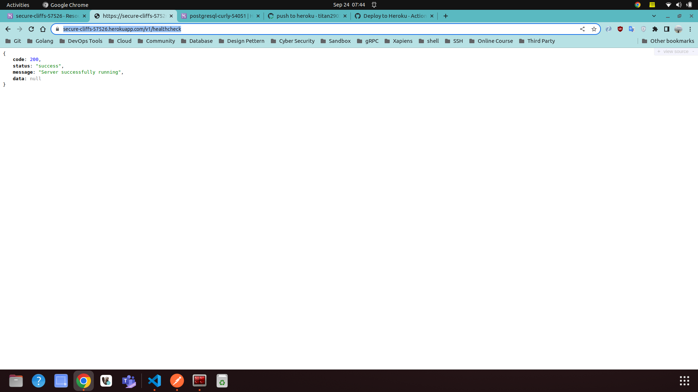
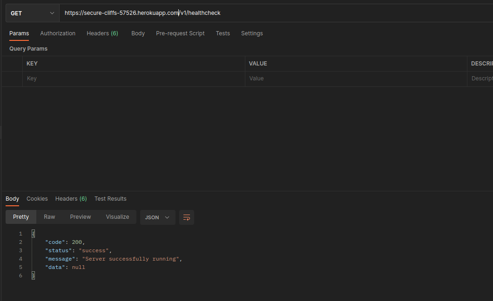
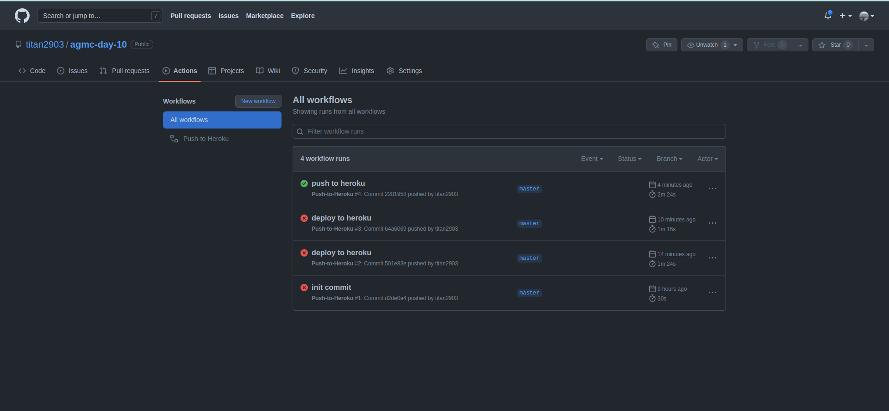
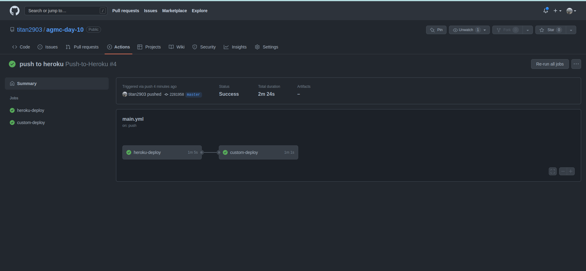

# RESTful API User, Review And Book

## Deployment on Heroku with CI/CD using Github Actions

- [Public URL Deployment Success](https://secure-cliffs-57526.herokuapp.com/v1/healthcheck)
  
- 

- 
  
- 

- 

## Docker Image

- Pull Docker Image from Docker Hub

  [Link URL to Docker Image agmc-day-10](https://hub.docker.com/r/titan29/agmc-day-10)

## Prerequisite

- [Go 1.18](https://golang.org/dl/)
- [GORM](https://gorm.io/index.html)
- [Echo Framework](https://echo.labstack.com/)

## Run the API Server

- Setup MongoDB Database
  
  [Tutorial Setup MongoDB Database Connection](https://www.youtube.com/watch?v=6utzRKiBZt0)

- Run the server

  ```shell
  go mod tidy
  ```
  
  ```shell
  go run main.go
  ```

- Run the Go Test

  - Go to folder handlers:

    ```shell
    cd internal/handlers
    ```

  - Run command below for running the test:

    ```shell
    go test
    ```
